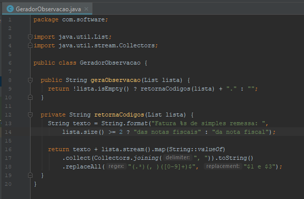

## Proposta
Além deste documento, está sendo enviado um arquivo compactado chamado **Exercicio2.zip**.
Dentre desse pacote consta uma classe Java chamada **GeradorObservacao**, sua respectiva
classe de testes e um JAR do JUnit que utilizamos para executar os testes.
Nesse exercício, você deve analisar esse código, e fazer duas coisas:
1. Descreva em texto livre, que coisas você acha que podem ser melhoradas nesse código. Se precisar pode colar imagens ou partes do código se isso o ajudar na explicação.
2. Refatore o código para resolver os problemas que você descreveu antes e nos envie a sua nova versão com melhorias. Lembre que iremos submeter sua versão do código aos mesmos testes que enviamos junto.

## Melhoria
- Uma melhoria essencial para esse código é converter o tratamento da lista em Stream do Java 8, porque existem otimizações e melhorias no processo de lista no Java 8.
- Também variável global não é acessada externamente.

## Codigo Original

## Refatoração
 
 
 
## Testes
 